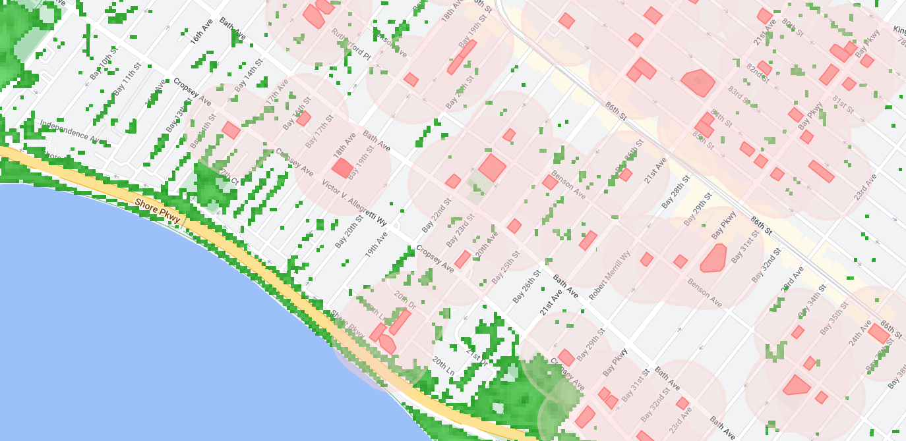

# Satellite Collection Pipeline - Building Statistics
This repo is meant to consolidate some of the tooling required to use Google Earth Engine for the collection of data pertinent in building energy consumption. Below you can find an example of what it looks like to capture vegetation adjacent to buildings in southern Brooklyn:



The initial Preprint, Open Access form of the work can be found here:
SSRN: https://papers.ssrn.com/sol3/papers.cfm?abstract_id=4204469

### Steps for getting running
1. conda env create -f environment.yml
2. conda activate thermal
3. earthengine authenticate
4. mkdir ./data/\<name\>/
5. cp <building_footprints> ./data/\<name\>/footprints.geojson
6. python run.py --city <directory_name> --settings default\_settings.yml --export

For a lite version of the code (if you have less than maybe 100 buildings, you don't need to export the data to google drive. Instead, the command can be as simple as:
```bash
python run.py --city sample
```
